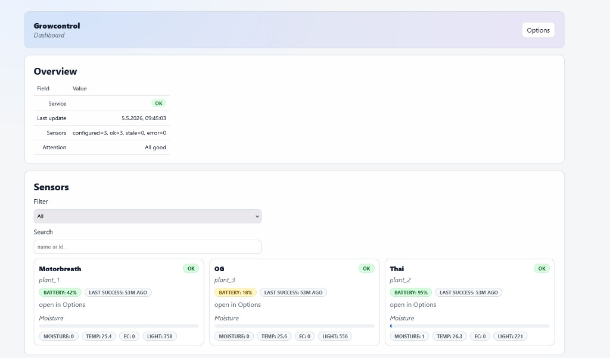
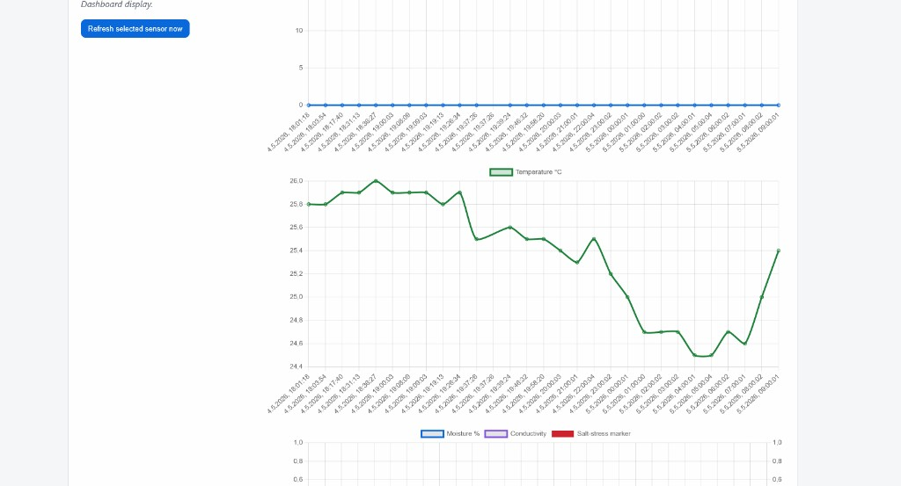

# Growcontrol

**Local plant monitoring dashboard for Raspberry Pi + Bluetooth plant sensors — track multiple values over time with charts, no cloud required.**

## What it does

Growcontrol turns a Raspberry Pi into a simple, local “plant monitor”: it polls BLE plant sensors, stores history, and shows an easy dashboard from your phone or PC. Everything stays on your LAN—built to monitor multiple plant values without cloud accounts.

## Key Features

- **See trends, not just numbers**: moisture, temperature, light and EC history charts
- **Know what needs attention**: quickly spot stale or erroring sensors
- **Fast onboarding in the browser**: scan → verify → add sensors
- **Optional weather context**: temperature / humidity / condition from OpenWeather
- **Optional MJPEG webcams**: attach one or more streams to sensors for live viewing
- **Built-in version + updater check**: the Dashboard footer shows version and whether updates are available (check-only; no auto-update)

## Screenshots

- **Dashboard overview**



- **Analytics view**




## Quick Start

### Prerequisites

- Raspberry Pi **3 or better** (recommended)
- Raspberry Pi OS / Debian-based Linux with `apt-get`
- Bluetooth enabled on the Pi (built-in Pi BT is fine)
- Supported BLE plant sensors: **Xiaomi HHCC Mi Flower Care Sensor** (MiFlora)
- Network access (for installation + optional weather)

### Optional hardware

- **USB webcam** (or Pi camera via mjpg-streamer) for live MJPEG streams in the Dashboard

### Install (one command)

Run as your normal login user (usually `pi`):

```bash
curl -sSL https://raw.githubusercontent.com/WomboCombo75/Growcontrol/main/install.sh | bash
```

When it finishes, open:

**`http://<your-pi-ip>/growcontrol/`**

Tip: run `hostname -I` on the Pi to see its LAN IP.

### Start / restart

```bash
sudo systemctl restart growcontrol-collector.service growcontrol-webapi.service
```

### MJPEG webcam recommendation

For the best MJPEG experience, use the updated mjpg-streamer fork:
[`WomboCombo75/new-mjpg-streamer`](https://github.com/WomboCombo75/new-mjpg-streamer)

Build [new-mjpg-streamer](https://github.com/WomboCombo75/new-mjpg-streamer), then set the install directory in **Options → Webcam**.

**Optional `config/settings.json` → `mjpg_streamer`:**

- **`default_http_port`**: used when **Stream URL** is empty so **Start MJPEG server** still knows which TCP port to bind (default `8080`).
- **`default_stream_url_path`**: path (and optional query) appended when Growcontrol **auto-fills Stream URL** after a successful start (e.g. `/?action=stream` or `/mjpeg/stream_simple.html`).
- **`camera`**: resolution, FPS, JPEG quality, and image tuning (brightness/contrast/sharpness/saturation) passed to `input_uvc.so`. Configure in **Options → Webcam → Camera capture**; stop the stream, save, then start again.

On **Dashboard → Analytics**, the webcam pill **Live / Stopped / Stream** is decided by a short TCP check from the Pi to the stream URL’s host and port (`GET /api/stream/listening` on the web API). After `git pull`, run **`./deploy_web.sh`** and **`sudo systemctl restart growcontrol-webapi.service`** so the UI and API stay in sync.

## Example Use Case

1. You place a Raspberry Pi in your grow tent and add a MiFlora sensor to each pot.
2. Growcontrol logs moisture + temperature over time and shows trends.
3. Temperature rises unusually fast → you notice it immediately on the dashboard trend.
4. You turn on a fan (or trigger your own automation) → temperature stabilizes.
5. Humidity drops after ventilation → you confirm the effect in the weather/metrics view.
6. You open the attached MJPEG stream to visually verify plant posture and substrate.


## Who is this for?

- **Hobby growers** who want to monitor multiple plant values locally (no cloud)
- **Raspberry Pi users** who prefer simple, local-first dashboards
- **IoT / DIY enthusiasts** who want a focused tool for plant monitoring

## Why this instead of Home Assistant?

Home Assistant is great for a whole smart home, but it can be heavy if you only want plant monitoring.

- **Growcontrol**: focused, quick to install, purpose-built UI for plant sensors + charts
- **Home Assistant**: broader ecosystem + integrations, more setup/maintenance overhead

If you already run Home Assistant, Growcontrol can still be useful as a dedicated “plant dashboard.”

## Project Status

- **Status**: actively developed (works for real setups; still evolving)
  - Actuation hooks (fan/humidifier) via GPIO / MQTT or any api

## Updating

- **UI only (HTML/CSS/JS):** from the repo directory, run `./deploy_web.sh` (needs `sudo` to write under `/var/www/html/growcontrol`), then hard-refresh the browser.
- **Python API / logic:** `git pull`, then `sudo systemctl restart growcontrol-webapi.service` (restart the collector too if you changed sensor code).
- **Full reinstall / deps:** run the one-line installer again (it also ensures `psmisc` for `fuser`, used when stopping MJPEG by port).

## Troubleshooting (quick)

```bash
sudo systemctl status growcontrol-bluetooth.service nginx growcontrol-collector.service growcontrol-webapi.service
journalctl -u growcontrol-collector.service -f
journalctl -u growcontrol-webapi.service -f
sudo nginx -t
rfkill list bluetooth
```

If BLE scan finds no devices, check that Bluetooth is not soft-blocked (`rfkill list`). The installer enables `growcontrol-bluetooth.service` to unblock and power on the adapter at boot on headless Raspberry Pi setups.

## Suggested GitHub topics

`grow-automation` `raspberry-pi` `iot` `home-automation` `environment-monitoring`
